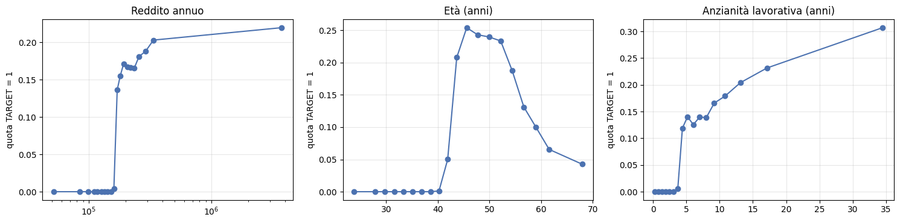
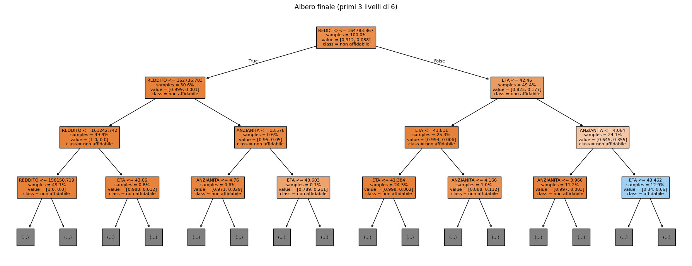

# Credit scoring spiegabile · Pro National Bank

Classificazione dell'affidabilità dei richiedenti di una carta di credito (338 mila richieste, 8,8% affidabili),
con un requisito in più rispetto alla sola accuratezza: **ogni rifiuto deve essere motivato**.

Il progetto nasce come esercitazione del Master in AI Engineering. Rivedendolo ho corretto alcuni errori e,
soprattutto, ho scoperto nei dati una struttura che ha cambiato la soluzione.

**▶ Demo live:** [Hugging Face Spaces](https://huggingface.co/spaces/MassimilianoCantore/credit-scoring): inserisci un profilo e ottieni l'esito con le motivazioni.

## La scoperta: tre requisiti minimi



Sotto circa **160 mila di reddito**, **40 anni di età** e **4 anni di anzianità lavorativa** nel dataset non c'è **nessun** cliente affidabile.
Sopra le soglie l'effetto diventa graduale. È una struttura a gradini, esattamente quella che un **albero decisionale** sa rappresentare.

## Risultati (test set, 67.686 clienti)

| Modello | ROC AUC | PR AUC | Spiegabile |
|---|---|---|---|
| Regressione logistica (cross-validation) | 0.944 | 0.542 | sì |
| Random Forest, 300 alberi (come nella prima versione) | 0.979 | 0.698 | no |
| **Albero decisionale, profondità 6** | **0.978** | **0.693** | **sì** |

Un solo albero leggibile vale quanto 300 alberi. Tutti i modelli non banali si fermano a ~0.978:
è il **limite dei dati**, non degli algoritmi. Tra i clienti che rispettano i requisiti nessun profilo supera il 70% di probabilità,
e per quei casi servirebbero informazioni che il dataset non contiene, come lo storico dei pagamenti.



## Cosa ho corretto rispetto alla prima versione

| Problema | Correzione |
|---|---|
| Motivazioni del rifiuto prese dalle feature importance **globali**: le stesse per ogni cliente | motivazione **per cliente**: quale requisito manca e di quanto |
| `CODE_GENDER` usato come variabile (il credit scoring è "ad alto rischio" per l'AI Act europeo) | escluso; verificato che toglierlo non costa nulla (PR AUC 0.6930 contro 0.6931) e che la recall è simile tra i generi (96%) |
| `df.drop("CNT_FAM_MEMBERS")` senza assegnazione: la colonna non veniva rimossa | rimossa davvero |
| SMOTE calcolato e poi non usato | rimosso; sbilanciamento gestito con PR AUC e soglia sul validation |
| Statistiche di preprocessing calcolate prima dello split | `Pipeline` addestrata solo sul training |
| Un solo split, solo ROC AUC, soglie 0.5 / 0.4 / 0.2 fissate a mano | cross-validation a 5 fold, PR AUC e Brier score, soglia scelta sul validation |

## Esempio di spiegazione

```
Esito: NON IDONEO · probabilità di affidabilità stimata 0%
- Reddito annuo: 110.959 sotto il requisito minimo di 156.891
- Anzianità lavorativa: 3.1 anni sotto il requisito minimo di 3.9 anni
```

## Struttura

```
notebooks/   credit_scoring.ipynb (eseguito, con output)
src/         prepara() + CreditScorer: esito, probabilità e motivazioni
app/         demo Gradio (Hugging Face Spaces)
results/     grafici
```

## Uso

```bash
pip install -r requirements.txt
```
```python
from huggingface_hub import snapshot_download
from credit_scoring.scoring import CreditScorer

scorer = CreditScorer(snapshot_download("MassimilianoCantore/credit-scoring-tree"))
esito, p, motivi = scorer.valuta({...})   # dizionario con le colonne del CSV originale
```

**Nota:** il dataset è didattico e la struttura a soglie così netta fa pensare a un'etichetta costruita con regole.
Su dati reali le prestazioni sarebbero più basse, e il monitoraggio nel tempo (deriva dei dati, verifica periodica dell'equità) sarebbe indispensabile.

## Stack
Python · pandas · scikit-learn · Gradio · Hugging Face Hub

---
Massimiliano Cantore · [LinkedIn](https://www.linkedin.com/in/massimiliano-cantore-3b19704a/)
